===========================
V8的Bytecode解释器Ignition
===========================
Bytecode介绍
=========================
V8使用的字节码可分为如下若干类：

- 前缀字节码，用于支持可扩展宽度的操作数
- 
  - Wide
  - ExtraWide
- 调试支持字节码，与调试相关
  
  - DebugBreakWide
  - DebugBreakExtraWide
  - DebugBreak0~DebugBreak6
- 寄存器转移字节码，加载或者存储寄存器中的值

  - Ldar
  - LdaZero
  - LdaSmi
  - LdaUndefined
  - LdaNull
  - LdaTheHole
  - LdaTrue
  - LdaFalse
  - LdaConstant
  - LdaContextSlot
  - LdaImmutableContextSlot
  - LdaCurrentContextSlot
  - LdaImmutableCurrentContextSlot
  - Star
  - Star0~Star15
  - Mov
- 测试操作字节码，与测试相关，无副作用
  
  - TestReferenceEqual
  - TestUndetectable
  - TestNull
  - TestUndefined
  - TestTypeOf
- 加载/存储全局类数据字节码
  
  - LdaGlobal
  - LdaGlobalInsideTypeof
  - StaGlobal
- 上下文操作字节码，涉及上下文的存储、切换

  - PushContext
  - PopContext
  - StaContextSlot
  - StaCurrentContextSlot

- 加载/存储lookup slot字节码，用于加载/存储某一对象，其名字是常量池中的一项

  - LdaLookupSlot
  - LdaLookupContextSlot
  - LdaLookupGlobalSlot
  - LdaLookupSlotInsideTypeof
  - LdaLookupContextSlotInsideTypeof
  - LdaLookupGlobalSlotInsideTypeof
  - StaLookupSlot

- 属性加载/存储操作字节码，与inline cache有关

  - LdaNamedProperty
  - LdaNamedPropertyNoFeedback
  - LdaNamedPropertyFromSuper
  - LdaKeyedProperty
  - StaNamedProperty
  - StaNamedPropertyNoFeedback
  - StaNamedOwnProperty
  - StaKeyedProperty
  - StaInArrayLiteral
  - StaDataPropertyInLiteral
  - CollectTypeProfile

- 加载/存储模块变量操作符

  - LdaModuleVariable
  - StaModuleVariable

- 二元运算字节码，用于支持加减乘除等操作

  - Add
  - Sub
  - Mul
  - Div
  - Mod
  - Exp
  - BitwiseOr
  - BitwiseXor
  - BitwiseAnd
  - ShiftLeft
  - ShiftRight
  - ShiftRightLogical
  - AddSmi
  - SubSmi
  - MulSmi
  - DivSmi
  - ModSmi
  - ExpSmi
  - BitwiseOrSmi
  - BitwiseXorSmi
  - BitwiseAndSmi
  - ShiftLeftSmi
  - ShiftRightSmi
  - ShiftRightLogicalSmi

- 单元运算字节码，用于支持加一、减一等操作

  - Inc
  - Dec
  - Negate
  - BitwiseNot
  - ToBooleanLogicalNot
  - LogicalNot
  - TypeOf
  - DeletePropertyStrict
  - DeletePropertySloppy

- 调用字节码，用于调用JSfunction或Callable等

  - CallAnyReceiver
  - CallProperty
  - CallProperty0~CallProperty2
  - CallUndefinedReceiver
  - CallUndefinedReceiver0~CallUndefinedReceiver2
  - CallNoFeedback
  - CallWithSpread
  - CallRuntime
  - CallRuntimeForPair
  - CallJSRuntime

- 调用内部函数字节码，与调用运行时函数语义等价

  - InvokeIntrinsic
- 构造器相关字节码

  - GetSuperConstructor
  - Construct
  - ConstructWithSpread

- 有副作用的测试操作字节码

  - TestEqual
  - TestEqualStrict
  - TestLessThan
  - TestGreaterThan
  - TestLessThanOrEqual
  - TestGreaterThanOrEqual
  - TestInstanceOf
  - TestIn

- 类型转换字节码

  - ToName
  - ToNumber
  - ToNumeric
  - ToObject
  - ToString

- 字面量操作字节码，创建不同类型的字面量

  - CreateRegExpLiteral
  - CreateArrayLiteral
  - CreateArrayFromIterable
  - CreateEmptyArrayLiteral
  - CreateObjectLiteral
  - CreateEmptyObjectLiteral
  - CloneObject

- 模板相关字节码，创建一个模板

  - GetTemplateObject
- 创建闭包字节码
  
  - CreateClosure
- 上下文分配字节码，创建不同类型的上下文

  - CreateBlockContext
  - CreateCatchContext
  - CreateFunctionContext
  - CreateEvalContext
  - CreateWithContext

- 参数分配字节码，创建不同类型的参数

  - CreateMappedArguments
  - CreateUnmappedArguments
  - CreateRestParameter

- 控制流字节码，涉及无条件跳转、有条件跳转等操作

  - JumpLoop
  - Jump
  - JumpConstant
  - JumpIfNullConstant
  - JumpIfNotNullConstant
  - JumpIfUndefinedConstant
  - JumpIfNotUndefinedConstant
  - JumpIfUndefinedOrNullConstant
  - JumpIfTrueConstant
  - JumpIfFalseConstant
  - JumpIfJSReceiverConstant
  - JumpIfToBooleanTrueConstant
  - JumpIfToBooleanFalseConstant
  - JumpIfToBooleanTrue
  - JumpIfToBooleanFalse
  - JumpIfTrue
  - JumpIfFalse
  - JumpIfNull
  - JumpIfNotNull
  - JumpIfUndefined
  - JumpIfNotUndefined
  - JumpIfUndefinedOrNull
  - JumpIfJSReceiver

- Switch语句的表查询字节码

  - SwitchOnSmiNoFeedback
- 支持复杂控制流for..in字节码

  - ForInEnumerate
  - ForInPrepare
  - ForInContinue
  - ForInNext
  - ForInStep

- 更新待决信息字节码

  - SetPendingMessage
- 非局部控制流字节码

  - Throw
  - ReThrow
  - Return
  - ThrowReferenceErrorIfHole
  - ThrowSuperNotCalledIfHole
  - ThrowSuperAlreadyCalledIfNotHole
  - ThrowIfNotSuperConstructor

- 生成器操作字节码，涉及生成器的挂起、恢复等操作

  - SwitchOnGeneratorState
  - SuspendGenerator
  - ResumeGenerator

- 迭代器字节码

  - GetIterator
- 块覆盖字节码，某个slot的执行计数加一

  - IncBlockCounter
- 执行中断字节码，调用运行时函数来中断执行

  - Abort
- 非法字节码

  - Illegal

BytecodeHandler和AOT编译
=========================
待完成。

解释执行过程
==================
Ignition解释器的一个任务是解释执行字节码，因此可以把Ignition解释器看作是一个bytecode handler的集合，不同的字节码由不同的bytecode handler来处理。bytecode handler由架构无关的汇编语言编写，由turbofan编译，生成对应特定架构的机器码，所以只需要编写一次。

和bytecode handler相关的一个概念是全局分派表，每个V8引擎的isolated的实例都有一个全局分派表，表中存储的是code object指针，每个指针指向一个bytecode handler。

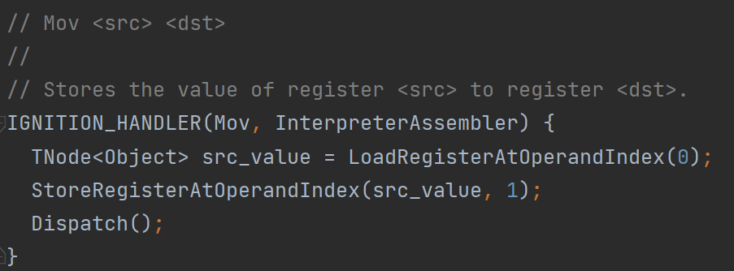

图中是一个对应到Mov这个字节码的bytecode handler的例子。首先从一个寄存器中加载值，然后把值存入另一个寄存器中，最后调用一个Dispatch函数。实际上，每个bytecode handler的末尾都会调用Dispatch函数。

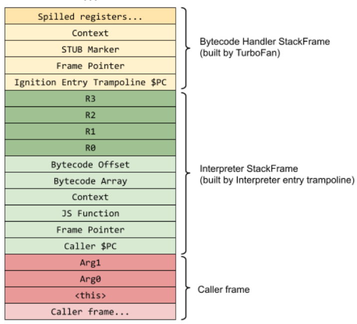

https://docs.google.com/document/d/11T2CRex9hXxoJwbYqVQ32yIPMh0uouUZLdyrtmMoL44/edit#

当一个函数在运行时被调用时，由于函数的代码入口地址被设置在InterpreterEntryTrampoline这个内置的stub，所以这个stub会在函数开始执行前做一些准备工作。它会为Ignition解释器建立一个合适的stack frame，并且初始化一些固定的机器寄存器，分配register file，然后分派一个bytecode handler来处理函数的第一个字节码。每个bytecode handler在最后会调用Dispatch函数来分派下一个字节码对应的bytecode handler，所以整个执行过程是一个流式的过程，不会出现某个被调用者执行完毕后返回到调用者的情况 。

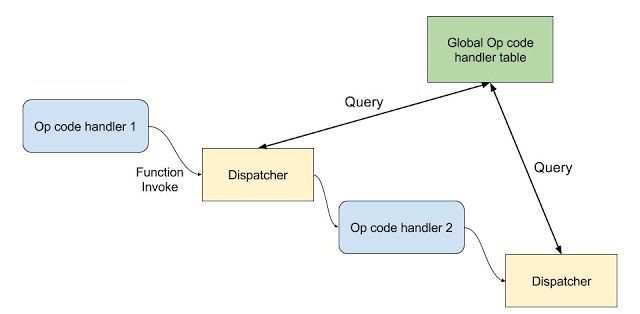

http://mshockwave.blogspot.com/2016/03/ignition-interpreter-in-v8-javascript.html

具体到代码，整个的调用链是这样的：Bytecode handler->Dispatch->DispatchToBytecodeWithOptionalStarLookahead->DispatchToBytecode->DispatchToBytecodeHandlerEntry->TailCallBytecodeDispatch->TailCallN->Next bytecode handler，在两个bytecode handler之间的部分可以看做是一个分派器。

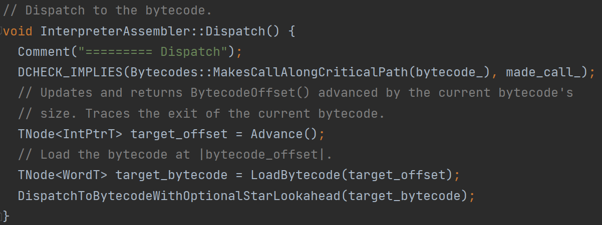

Dispatch函数首先把当前的字节码偏移量前进一个字节码长度，这样就得到了下一个要处理的字节码的偏移量，然后从这个偏移量加载对应的字节码，得到目标字节码，最后调用DispatchToBytecodeWithOptionalStarLookahead函数。

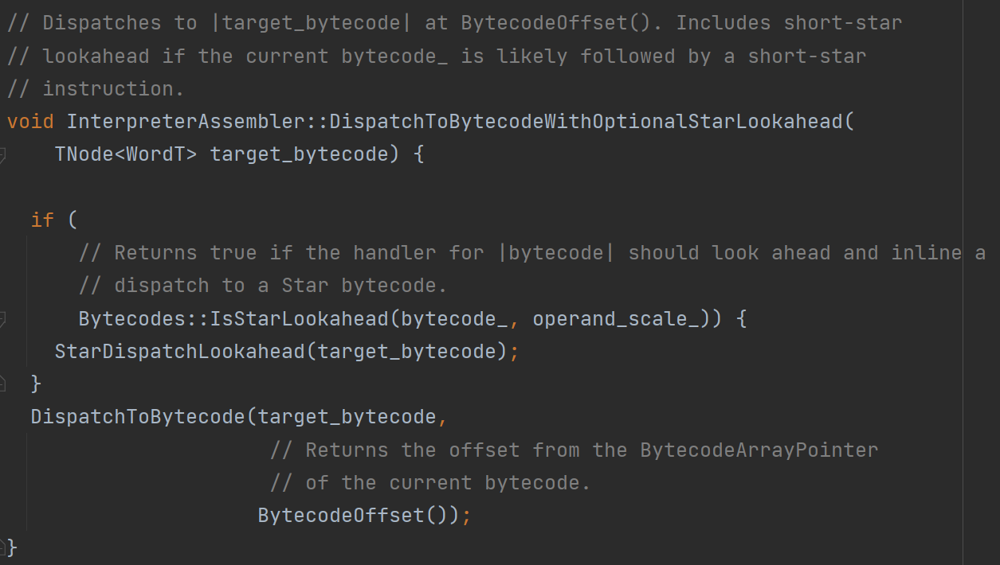

DispatchToBytecodeWithOptionalStarLookahead函数对一种特殊情况做了处理，它基于特定的目标字节码再往前看一步，如果目标字节码的后面跟随了一个short star指令，那么就需要在当前的字节码偏移量处为short star构建代码，short star并不会由它对应的bytecode handler处理，而是把对应的bytecode handler的处理逻辑内联到此处。一般的star指令指的是把Accumulator寄存器中的值存储到某个寄存器中，如果目标寄存器位r0，那么对应short star指令就是star0，从而省略了r0这个操作数；如果不满足这种特殊情况，则不需要额外处理，直接用目标字节码和它对应的字节码偏移量作为参数调用DispatchToBytecode函数。

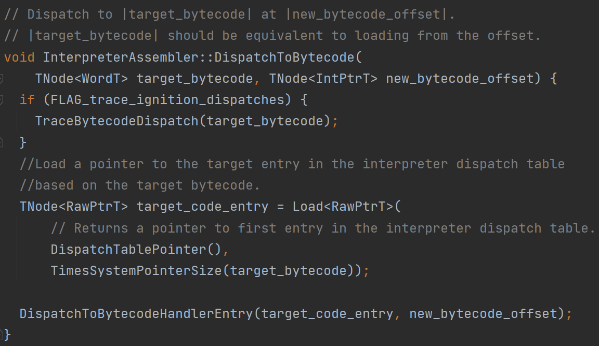

DispatchToBytecode函数主要做的事情是从全局分派表里，根据字节码来加载表中对应的一项，实际得到的是一个指针，指向表中的一项。现在已知应该用哪个bytecode handler来处理目标字节码，接下来调用DispatchToBytecodeHandlerEntry函数。

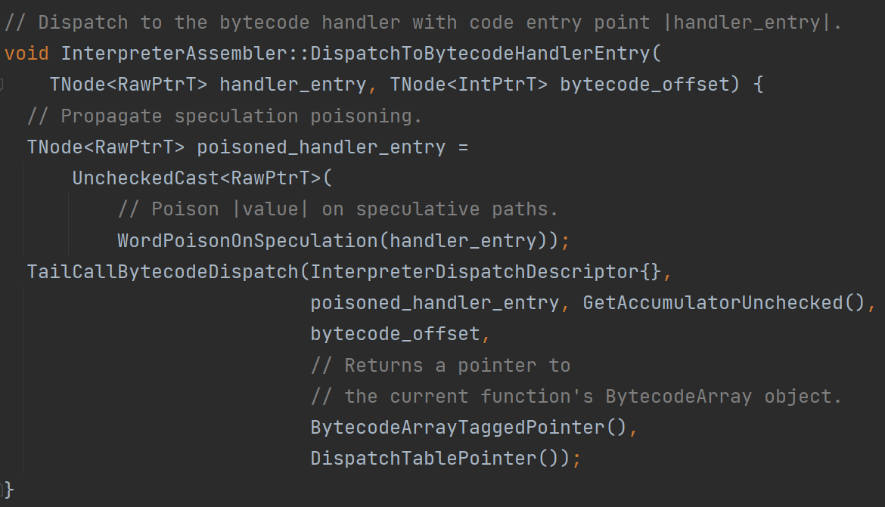

DispatchToBytecodeHandlerEntry函数首先对bytecode handler项做了一个关于分支预测的安全处理，处理结束以后，会调用TailCallBytecodeDispatch函数，此时把调用描述符，bytecode handler项，Accumulator寄存器，字节码偏移量等参数传过去。

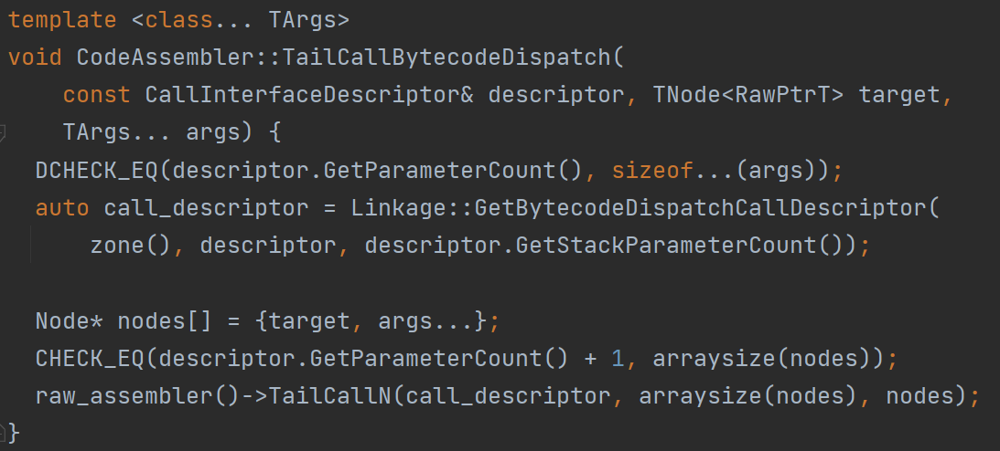

TailCallBytecodeDispatch函数把除了描述符之外的参数全部放到一个数组里面，然后把调用描述符和数组作为参数调用TailCallN函数。

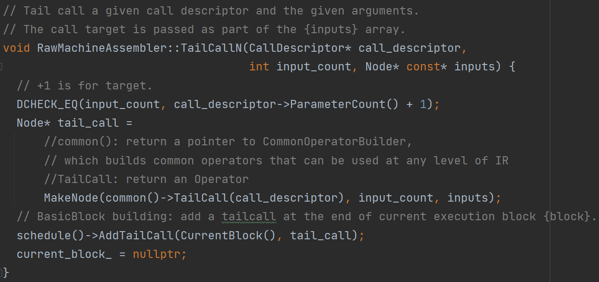

最后在TailCallN函数中，首先根据调用描述符得到一个操作符，然后根据接收到的参数构建一个节点，最后把这个节点放到当前执行块的末尾。

这就是整个分派器做的事，当执行到这个末尾的节点的时候，实际上就是用对应的bytecode handler来处理下一个目标字节码，从而可以如流水一般不断地执行下去。

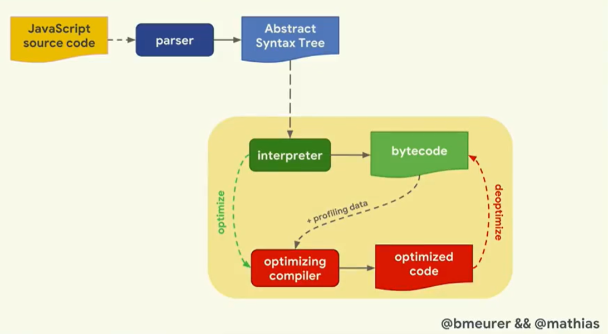

https://www.youtube.com/watch?v=5nmpokoRaZI

在解释执行字节码的过程中，Ignition解释器同时还有收集函数执行过程中的反馈信息的任务。比如，在程序运行的同时，Ignition解释器会注意到对象的数据类型，并通过存储相关信息将其反映出来，以便后续的优化。这部分工作主要是由inline cache负责。

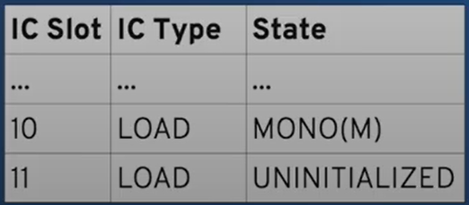

https://slides.com/ripsawridge/deck

更具体的，收集到的反馈信息是存储在FeedbackVector内的，FeedbackVector可以被理解为一个带有头部信息的slot序列。Bytecode handler会把FeedbackVector传给inline cache stub，inline cache stub可以更新FeedbackVector里的内容，这些反馈信息会被turbofan这个优化编译器利用，用来生成优化后的机器码。

采用了这种机制后的一个好处是可以减少访问对象属性的时间。

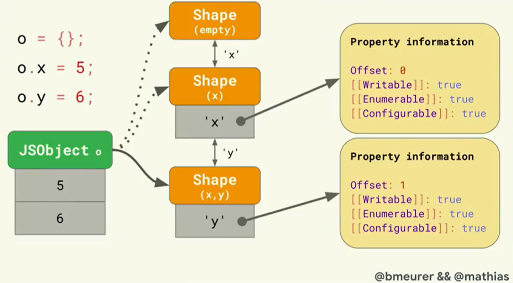

https://www.youtube.com/watch?v=5nmpokoRaZI

首先我们需要了解对象的属性信息是怎么组织的。为了节省存储空间，我们使用map，或者说hidden class，也可以说是shape，来描述对象的结构，shape 不涉及具体的对象属性值，但是可以表示每个属性的相关性质，比如说某个属性的偏移量，是否可写等信息，这样就允许多个结构相同的对象共享同一个map。采用了map机制后，一般的访问属性的过程是这样的：如果要访问一个对象o的属性x，那么首先找到map中x的部分，然后找到x对应的属性信息，得到x的偏移量是0，最后在JSObject的偏移量为0的地方找到x的值。

但是因为FeedbackVector存储了收集到的函数执行过程中的反馈信息，我们可以把上述访问对象属性的过程变得更加快捷。当字节码涉及对对象的属性的加载或者存储操作时，字节码对应的bytecode handler会调用loadIC stub或者storeIC stub。在加载属性的情况下，loadIC stub被调用，它会去查询TypeFeedbackVector，找到对应的slot，如果状态是monomorphic，那么继续检查对象的map，和slot中存储的map是否一致，如果一致的话，就可以使用slot中存储的偏移量来获取对象的属性值；如果不一致的话，就只能按一般的方法去查询对象的属性值，这样速度会更慢，而且还需要更新FeedbackVector里对应的slot。
每个slot中存储一个会被使用的inline cache stub以及它的状态。状态monomorphic指的是inline cache stub处理过的对象的map都是相同的。状态polymorphic指的是inline cache stub处理过少量map不同的对象。如果原来inline cache stub的状态是monomorphic，一但遇到一个对象的map和之前不一样就需要把monomorphic更新成polymorphic。如果inline cache stub处理非常多不同map的对象，那么polymorphic还会被更新成其他状态。
实际上一个函数的FeedbackVector在生成AST阶段就已经被确定了要存储哪些inline cache stub的状态，或者说信息，只不过对应的状态值是未初始化的。

在解释执行字节码的过程中，如果某个inline cache stub被第一次执行，此时是没有办法利用FeedbackVector中的信息的，所以只能按一般的方法，首先找到对象的map，然后查询属性的对应的信息，得到对应的偏移量后根据偏移量从JSObject中获取属性的值，经过这些步骤之后，就可以在TypeFeedbackVector里把状态值从未初始化的更新为monomorphic状态，并且更新map，偏移量等信息。

当这个inline cache stub被第二次执行的时候，FeedbackVector已经有了关于它的一些信息，此时可以检查是否满足一些条件，满足的话就可以直接使用FeedbackVector里存储的偏移量来从JSObject获取属性值，相当于省略掉了根据map中对应的属性查询其相关信息的步骤。

以上过程都是属于解释执行过程，我们还需要决定是否要生成优化代码。如果某个函数它经常被调用，而且在解释执行的过程中，FeedbackVector已经包含了足够多的信息，那么我们就可以优化它，这部分就是turbofan的工作了。但实际上，turbofan生成的机器码的逻辑和上述查询过程大致上是一样的，只不过当有条件不满足的时候就进行反优化。

具体到代码中，以加载对象属性为例，对应的bytecode handler的任务是把某一个对象的指定属性的值加载到Accumulator寄存器中。它首先获取当前函数的FeedbackVector，然后获取属性名称，上下文，还有FeedbackVector中对应的slot，接着把这些信息传递给loadIC stub，最后把得到的属性值存到Accumulator寄存器里，最后调用Dispatch函数分派下一个bytecode handler。

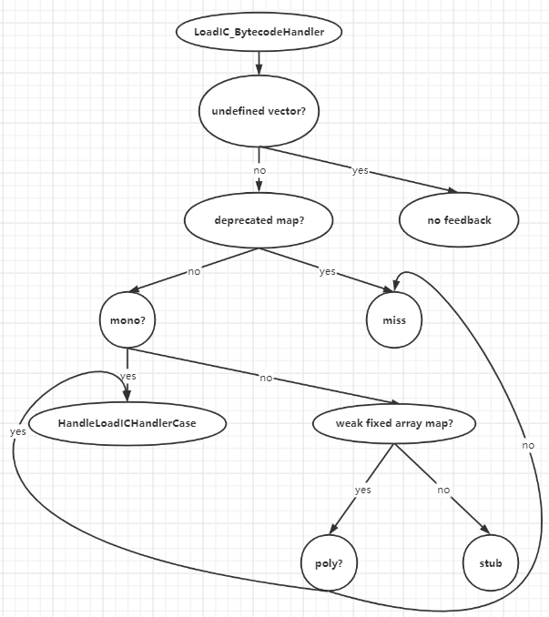

图中展示了loadIC stub的控制逻辑结构。首先它会判断收到的FeedbackVector有没有被定义，如果没有，就转到no feedback分支，这里会调用一个名为kLoadIC_NoFeedback的内置函数来处理没有feedback的情况。如果FeedbackVector确实被定义了，然后再检查对象的map是否被弃用，如果被弃用，就转到miss分支，这里会调用一个名为kLoadIC_Miss的运行时函数来处理这种情况。如果map没有被弃用，那么它就会检查是否满足monomorphic的情况，如果满足，就得到FeedbackVector中对应的一项，最后调用HandleLoadICHandlerCase这个函数来根据反馈信息加载属性值。如果不满足monomorphic的情况，那么就只能退而求其次，检查是否满足polymorphic的情况，如果满足，那么也能在FeedbackVector中找到相关的信息，这部分是用一个循环来寻找的，最后同样调用HandleLoadICHandlerCase这个函数加载属性值。如果还是不满足polymorphic的情况，那就无法利用FeedbackVector中的信息，一种情况是转到之前的miss分支，一种情况是转到stub分支，调用一个名为kLoadIC_Noninlined的内置函数来处理这种情况。
